# Results gallery — inflation tax on Canadian households

This gallery collects every figure under `output/figures/` with a short reading guide. Companion CSVs live in [`output/tables/`](../output/tables/). Evolving interpretation and open issues are in [`paper_notes.md`](paper_notes.md); short and extended abstracts are in [`abstract.md`](abstract.md) and [`extended_abstract.md`](extended_abstract.md).

## What the paper does

Edward N. Wolff’s net inflation gain identity \(NIG = IG - IT\) pairs an inflation tax on income with balance-sheet gains from debt devaluation and asset revaluation (NBER WPs 31775 and 29392). This project adapts that accounting to Canada using the Survey of Financial Security (SFS, 1999–2023): Wolff-style marketable net worth, PBO look-through for registered accounts, and 60/40 mutual-fund allocation. Core results are \(NIG\) by wealth quintile, tenure, age, and analytic region. A Survey of Household Spending (SHS) appendix adds recent cash-flow / basket incidence (necessities and shelter shares) for 2017–2023 only; it complements, and does not replace, the SFS balance-sheet history.

## Caveats (read first)

- **PUMF limits.** SFS cannot support reliable ultra-wealthy inference; treat Q5 \(NIG\)/income magnitudes as fragile / upper-bound. No CMA on the EFAM PUMF; geography stops at province / analytic region.
- **Registered mix.** PBO non-registered look-through likely understates equity inside RRSPs/TFSAs. Mutual funds stay at 60/40.
- **Accounting choices.** Real rates floored at 0.5%; equity consol wedge capped. Period results fix portfolios at the start of each inter-wave interval.
- **Mortgage institutions.** Wolff’s 30y FRM affordability curve is a U.S. benchmark beside Canadian amortization schedules; short-term renewal risk and rate pass-through are deferred.
- **SHS ≠ SFS.** SHS cuts are by household income (not wealth); units and concepts differ from EFAM \(NIG\). Never read SHS panels as wealth-quintile results.

---

## 0. Macro context (introduction)

Script: `code/11_macro_context_figure.R`. Table: `data/external/macro_context_annual.csv`. Sources: [`MACRO_CONTEXT_SOURCES.md`](../data/external/MACRO_CONTEXT_SOURCES.md).

### Canadian rates, inflation, asset returns, and wages (~1998–present)

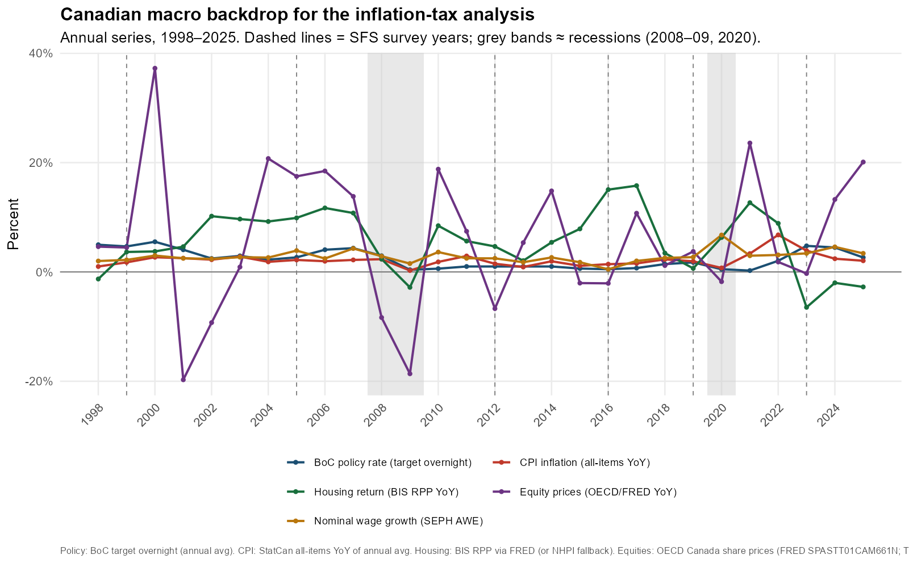

Annual series for the paper’s introduction: Bank of Canada **target overnight rate** (policy rate; annual average), StatCan all-items CPI inflation, housing appreciation (BIS residential property prices via FRED, or NHPI fallback), S&P/TSX Composite **price** returns, and SEPH average weekly earnings growth. Dashed lines mark SFS survey years; grey bands approximate recessions (2008–09, 2020). Use this as backdrop only—household \(NIG\) is computed at SFS waves, not from these macro paths alone.

---

## 1. NIG core (wealth quintiles)

Tables: `nig_by_year_wealth_quintile.csv`, `nig_by_period_wealth_quintile.csv`, `portfolio_by_wealth_quintile.csv`.

### Net inflation gain / income (latest SFS wave)

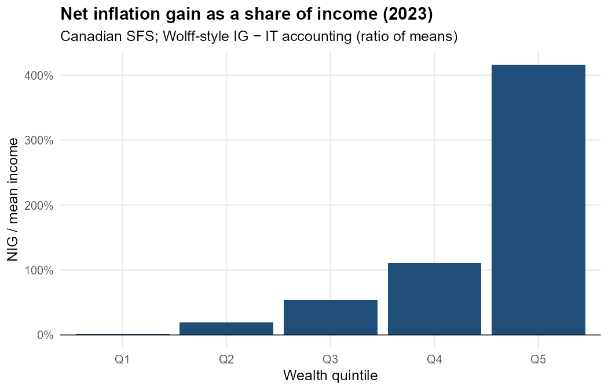

Headline snapshot: \(NIG\) as a share of mean income by wealth quintile in the latest SFS year. Bars above zero mean balance-sheet inflation gains exceed the income tax on that group’s mean income (ratio of means). Middle quintiles are typically strongly positive—qualitatively echoing Wolff’s “not a tax for the middle class”—while Q1 is near zero on thin balance sheets. Q5’s large ratios are primarily long-duration equity/business revaluation, not leverage: in 2023, mean STK+BUS is ~$900k (Q5) vs ~$30k (Q3) and ≈85% of Q5 \(IG\); debt/assets are lowest at the top (~0.08 vs ~0.28 for Q3), so debt devaluation is a small share of top \(IG\) and \(IT\) barely offsets it. Middle/lower quintiles rely more on debt devaluation; the 2016–2019 Q5 loss is the same STK/BUS channel with the sign flipped when real rates rose. Magnitudes are fragile (PUMF top-coding).

### Period \(NIG\) / income by quintile

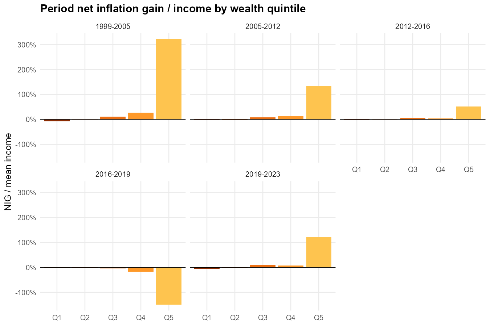

Each facet is an inter-wave spell with portfolios held fixed at the start of the interval. Compare signs across periods: high-inflation / falling-rate spells (e.g. 1999–2005, 2019–2023) favour middle quintiles; 2016–2019 shows mild inflation with rising real rates, so \(NIG\) often turns negative. Read within-facet quintile gradients rather than comparing absolute levels across periods with very different cumulative CPI.

### Debt / assets by wealth quintile

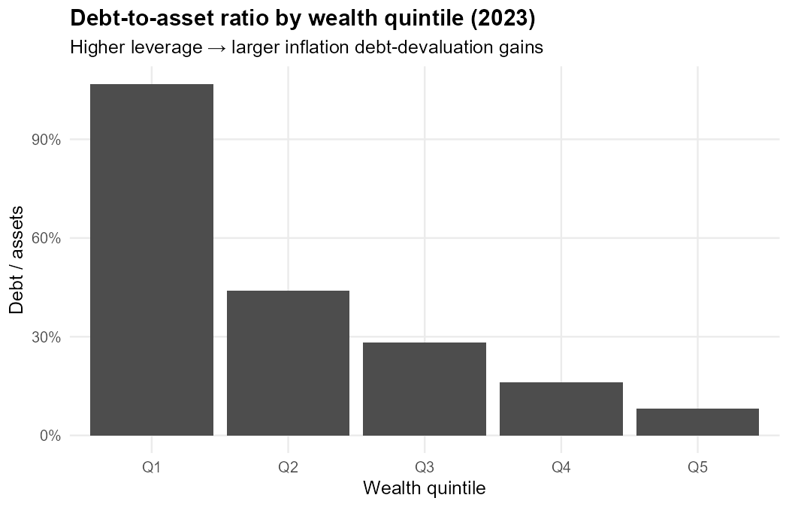

Leverage that feeds the debt-devaluation term of \(IG\). Debt/assets fall sharply from Q1 to Q5: the bottom has high leverage but small asset bases, so income tax can dominate; middle groups combine meaningful debt with larger portfolios. Pair with the \(NIG\)/income bars above—high leverage alone does not guarantee high \(NIG\)/income.

---

## 2. Inflation sensitivity

Table: `nig_inflation_sensitivity.csv`.

### Counterfactual inflation and \(NIG\) / income

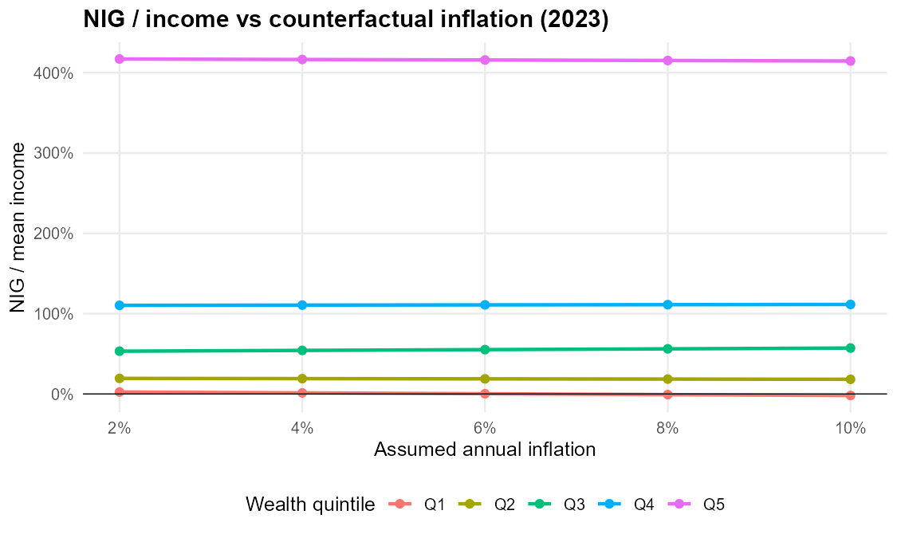

Holding the latest-year balance sheets fixed, each line traces \(NIG\)/income as assumed annual inflation varies. Slopes show how sensitive each quintile is to the inflation rate used in \(IG\) and \(IT\). Higher quintiles typically sit higher and rise with inflation via asset/debt channels; Q1 stays flatter near zero. Use this as a robustness check on the headline snapshot, not as a forecast.

---

## 3. Inequality and revaluation

Tables: `revaluation_contributions_by_period.csv`, `inequality_revaluation_by_period.csv`, `inequality_baseline_by_year.csv`.

### Mean revaluation contributions by period

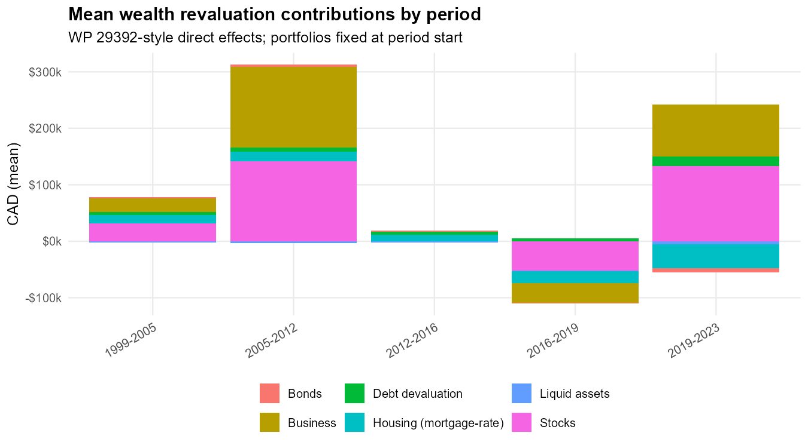

Stacked mean dollar contributions (stocks, business, bonds, liquid assets, debt devaluation, housing mortgage-rate channel) with portfolios fixed at period start (WP 29392-style). Positive stacks mean rising mean wealth from the inflation/rate path; composition shows which channel dominates. Equity/business often dominate means in rate-decline spells; debt devaluation is the more equalizing / middle-class channel in the broader story.

### Change in wealth Gini from revaluation

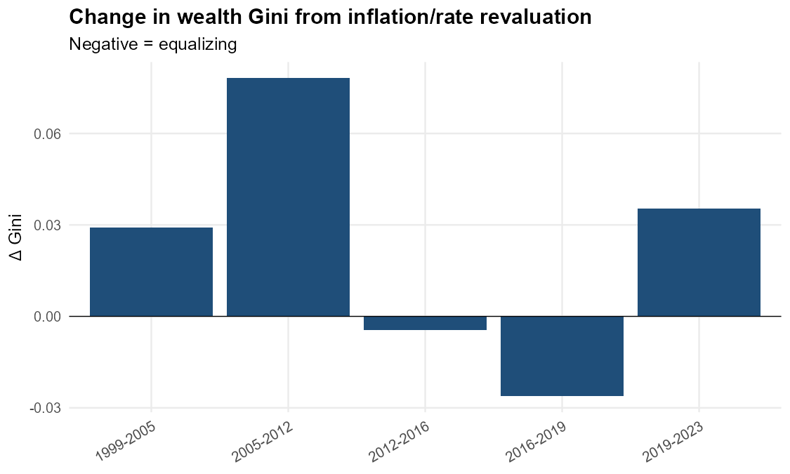

\(\Delta\)Gini from applying the period revaluation to start-of-period wealth. Negative bars are equalizing; positive bars mean the revaluation widened measured wealth inequality (e.g. when equity gains concentrate at the top). Contrast with Wolff’s U.S. finding that monetary effects were strongly equalizing—Canadian periods can go either way depending on the rate path.

---

## 4. Mortgage affordability and housing channel

Tables: `mortgage_affordability_curves.csv`, `mortgage_affordability_wolff_points.csv`, `mortgage_hp_ratio_sensitivities.csv`, `housing_status_by_year.csv`, `housing_channel_by_tenure_period.csv`.

### Wolff 30y FRM vs Canadian amortization

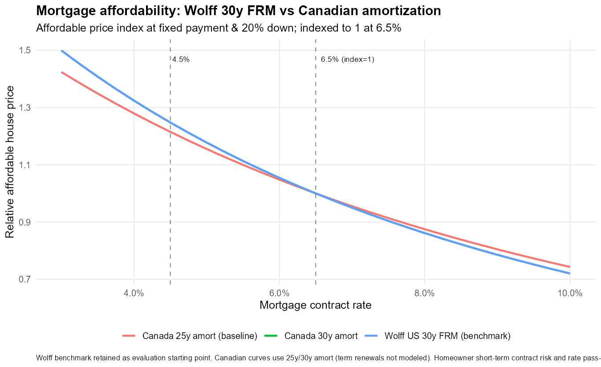

Affordable house-price index at fixed payment and 20% down, normalized to 1 at a 6.5% rate. Wolff’s 30-year FRM curve is the U.S. benchmark; Canadian curves use domestic amortization (25y/30y). Lower rates raise the affordable price index. Institutional differences matter for how much a rate path translates into a housing “affordability shock,” even before Canadian short-term renewals (deferred here).

### Period house-price affordability ratios (sensitivities)

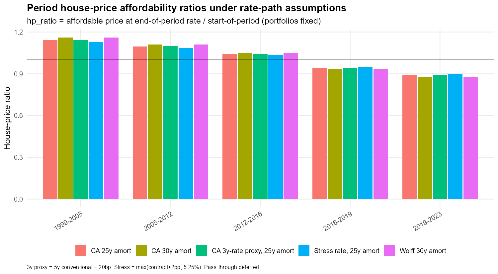

For each inter-wave spell, \(hp\_ratio\) = affordable price at end-of-period mortgage rate ÷ start-of-period rate, under alternative assumptions (Canadian 25y baseline, 30y amort, 3y-rate proxy, stress rate). Values above 1 mean the rate path raised the affordable price (easing); below 1 is tightening. Use the spread across assumptions as a sensitivity band around the housing channel, not a measured Teranet price change.

### Housing status shares (latest)

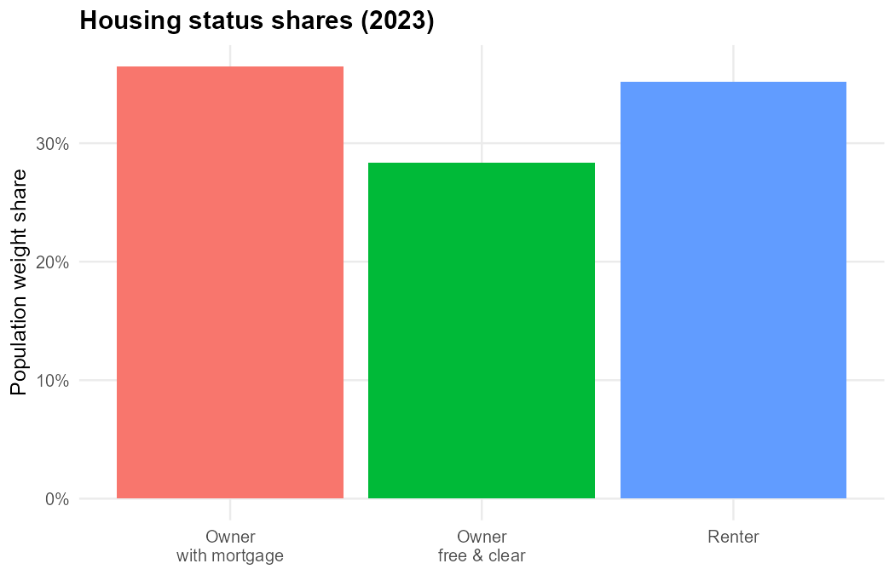

Weighted population shares of owner-with-mortgage, free-and-clear owner, and renter in the latest SFS wave. Sets the scale for tenure-specific results: mortgage and free-clear owners dominate Canadian wealth; renters are a large population share with thin balance sheets. Pair with tenure \(NIG\) and housing-channel figures below.

### Housing / debt channels by tenure (latest period)

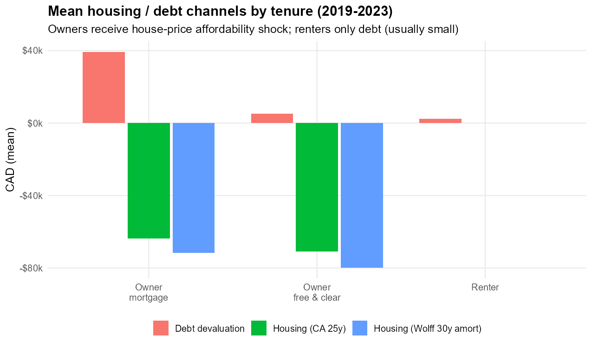

Mean dollar housing affordability and debt-devaluation contributions by tenure for the most recent inter-wave period. Owners receive the house-price affordability shock; renters mainly see small debt effects. Free-and-clear owners can still show large housing-channel dollars when the affordability index moves, even without mortgage debt—read jointly with core \(NIG\) (which excludes this housing HP channel unless noted).

---

## 5. Tenure, age, and geography

Tables: `nig_portfolio_by_*_latest.csv`, `nig_by_period_age_band.csv`, `nig_by_period_geo_group.csv`, `nig_portfolio_by_age_tenure_latest.csv`, `geo_availability_note.csv`.

### \(NIG\) / income by housing tenure (latest)

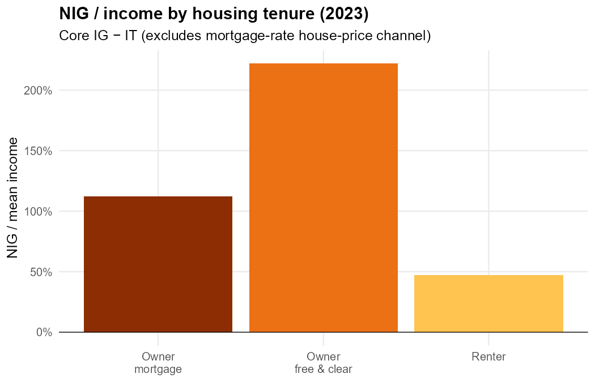

Core \(IG - IT\) (excluding the mortgage-rate house-price channel) by tenure. Free-and-clear owners typically show higher \(NIG\)/income than mortgagors—diverging from a pure leverage narrative—while renters sit lowest. Read as stock composition (equity, housing equity, debt) relative to income, not as a welfare ranking.

### \(NIG\) / income by age band (latest)

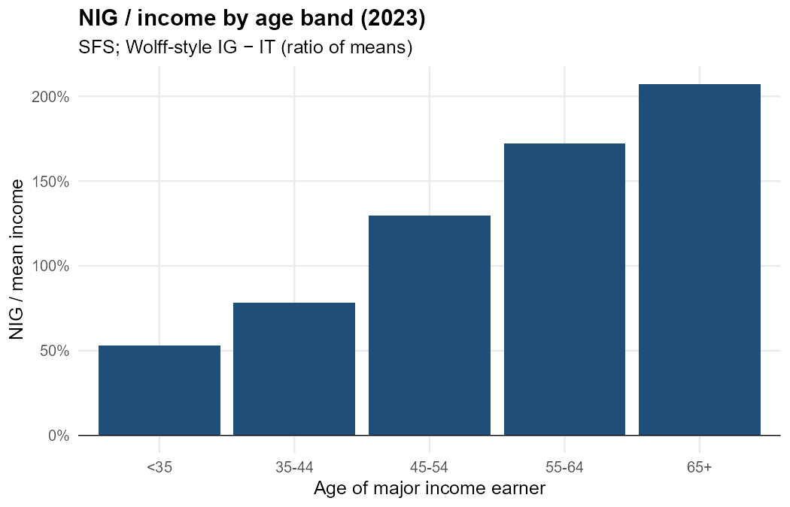

Life-cycle gradient for the major income earner’s age band. Older bands usually post higher \(NIG\)/income as net worth and equity exposure accumulate. Young households combine higher leverage with smaller portfolios and incomes that keep the tax more competitive.

### Debt / assets by age band (latest)

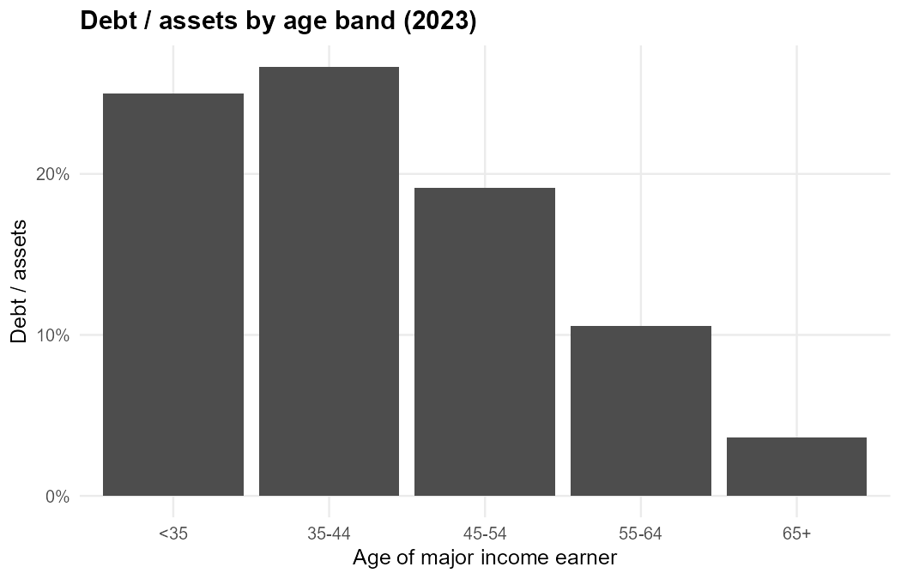

Leverage across the same age bands. Debt/assets typically fall with age as mortgages amortize and assets accumulate. Contrasts with the rising age \(NIG\)/income profile: middle-age and older gains are more asset-revaluation than debt-devaluation.

### \(NIG\) / income by age × tenure (latest)

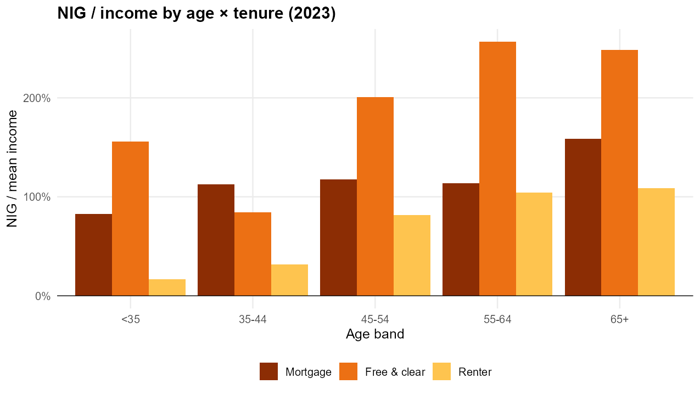

Dodged bars for mortgage / free-and-clear / renter within each age band. Isolates whether the free-and-clear advantage holds across the life cycle and where renters remain most exposed. Useful check that tenure patterns are not just age composition.

### \(NIG\) / income by analytic region (latest)

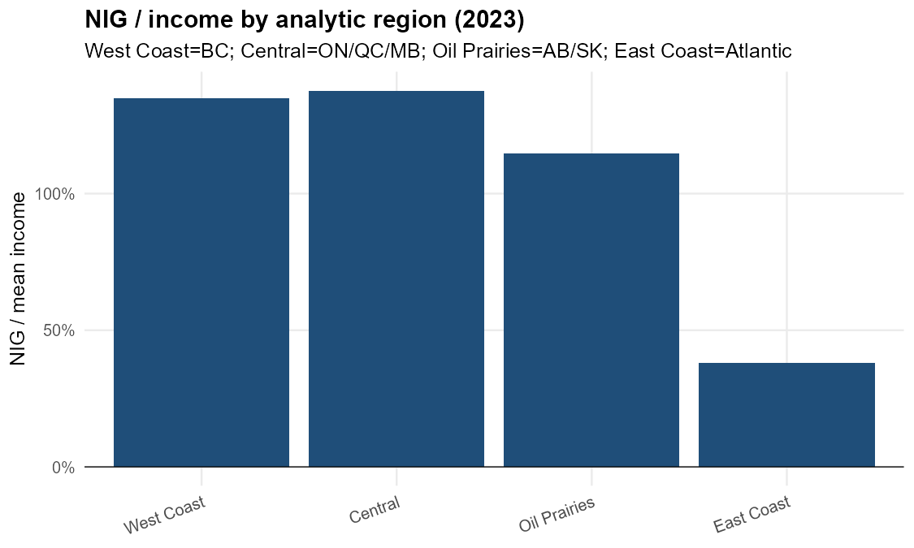

Four analytic regions: West Coast (BC); Central (ON/QC/MB); Oil Prairies (AB/SK); East Coast (Atlantic). Bars show regional mean \(NIG\)/income in the latest wave. Province is missing in 2005 on this panel; analytic `geo_group` uses a region fallback that year (Prairies unsplit)—see `geo_availability_note.csv`.

### \(NIG\) / income by province (latest)

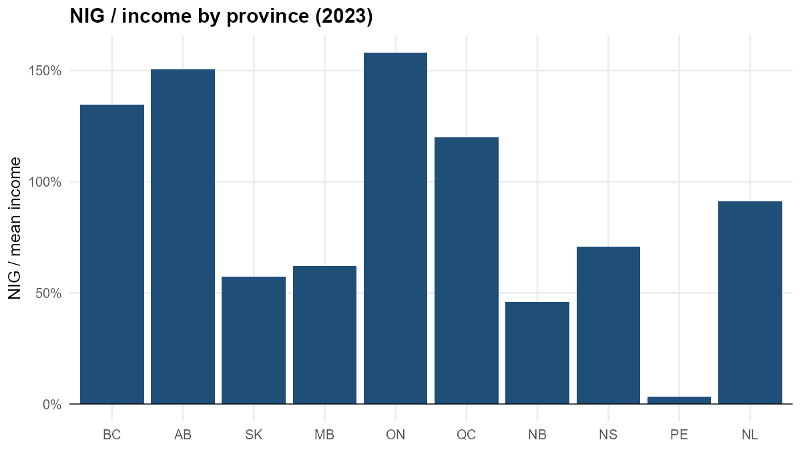

Finer provincial cut of the same latest-year \(NIG\)/income measure. Cross-check the analytic-region aggregates; small Atlantic cells can be noisier. Territories are not on the PUMF.

### Mean Wolff net worth by province (latest)

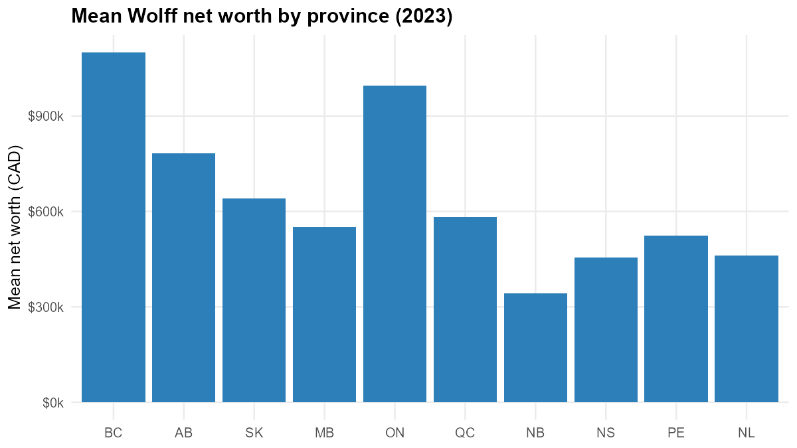

Mean marketable net worth (Wolff-style) by province. Levels the balance-sheet backdrop for provincial \(NIG\) differences—high-\(NIG\) provinces often have thicker equity/housing stocks, not just different leverage.

### Mean Wolff net worth by analytic region over time

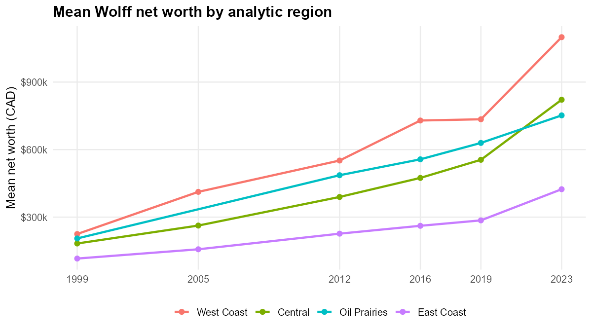

Mean net worth by analytic region across SFS waves. Tracks whether regional wealth gaps widened or narrowed over 1999–2023. Levels rise with asset prices; relative ordering is what matters for interpreting geographic \(NIG\) gradients.

### Period \(NIG\) / income by analytic region

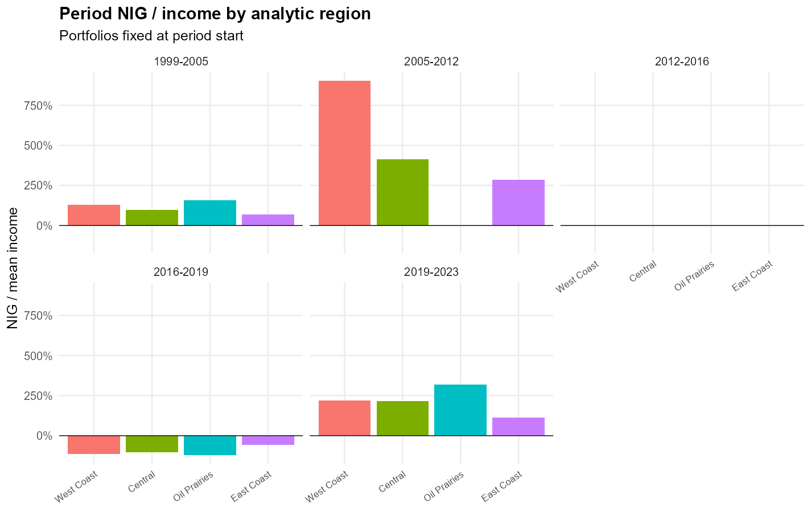

Faceted inter-wave \(NIG\)/income by analytic region with start-of-period portfolios. Shows whether regional rankings are stable across inflation/rate regimes (including the 2016–2019 rate-rise contrast).

### Period \(NIG\) / income by age band

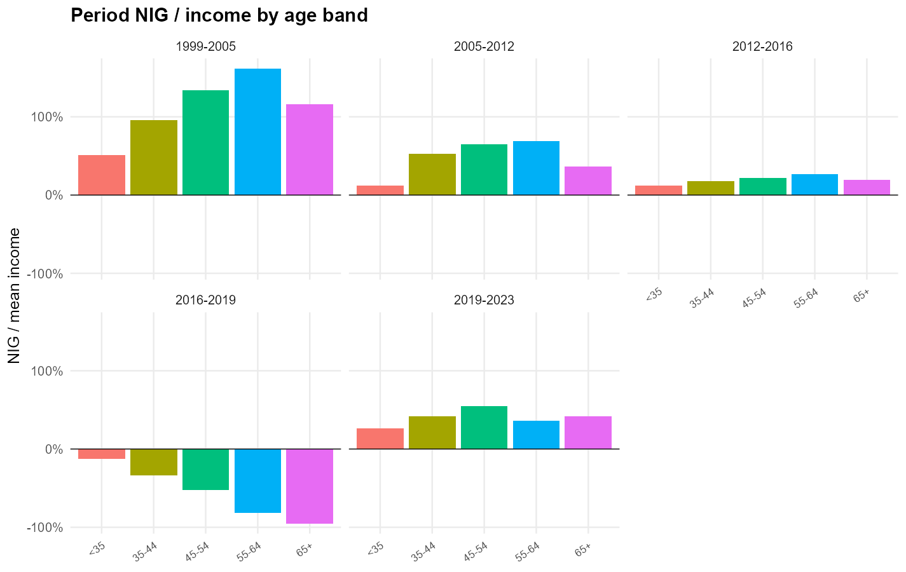

Same period design by age band. Life-cycle gaps can compress or widen depending on the rate and inflation path; older bands typically remain more positive when equity revaluation is large.

---

## 6. SHS consumption appendix

Tables: `shs_consumption_by_income_quintile.csv`, `shs_consumption_by_tenure.csv`, `shs_consumption_by_region.csv`, `shs_sfs_juxtaposition_2019_2023.csv`, `shs_years_loaded.csv`. Plan: [`03_shs_consumption_plan.md`](03_shs_consumption_plan.md).

### Necessities share by income quintile

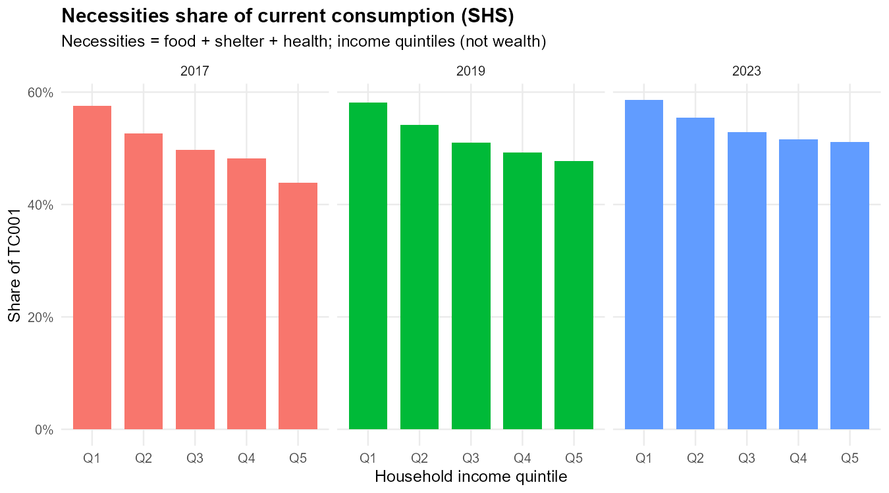

Necessities (food + shelter + health) as a share of current consumption (`TC001`), by within-year household income quintile—not wealth. The share typically falls with income (cash-flow inflation exposure). Lines/points across 2017/2019/2023 show recent movement; do not equate these quintiles with SFS wealth Q1–Q5.

### Shelter share by income quintile

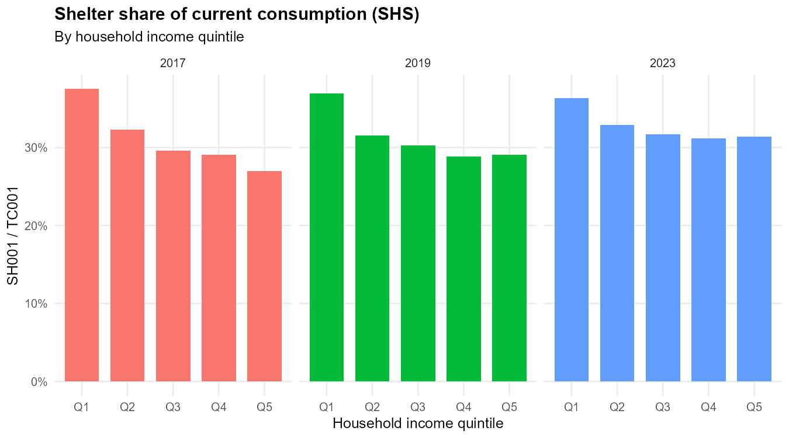

Shelter alone as a share of current consumption by income quintile. Isolates the housing-cost piece of the basket channel. Lower-income households usually devote a larger share of spending to shelter even when SFS \(NIG\) is near zero for thin balance sheets.

### Shelter and mortgage-payment exposure by tenure

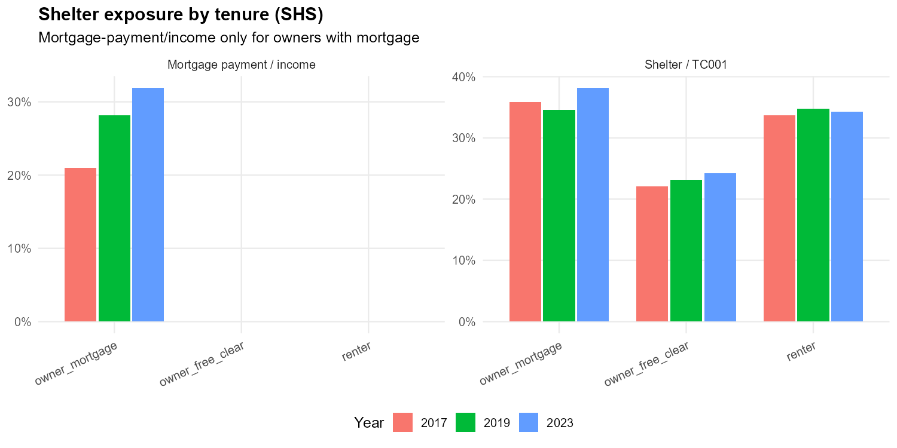

Shelter share by tenure, with mortgage-payment/income shown for mortgagors. Renters and low-income mortgagors are the cash-flow-exposed groups; free-and-clear owners have lower SHS necessities/shelter shares—the stock–flow divergence versus high SFS \(NIG\)/income for free-and-clear owners.

### Shelter share by analytic region

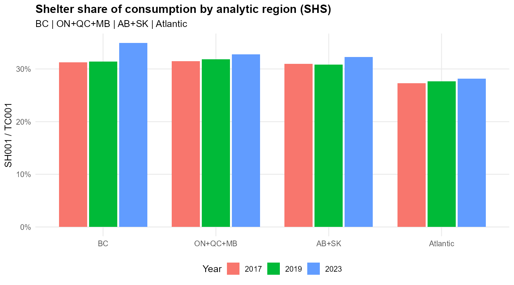

Regional shelter shares using the same analytic geography as the SFS cuts (BC | ON+QC+MB | AB+SK | Atlantic). BC typically posts the highest shelter share; Atlantic the lowest among the four. Complements regional \(NIG\) with a spending-side read of housing cost pressure.

### SFS \(NIG\) vs SHS necessities by tenure (2019 & 2023)

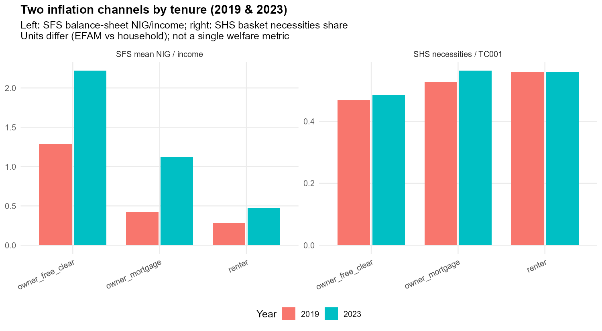

Side-by-side: left = SFS balance-sheet \(NIG\)/income by tenure; right = SHS necessities share by tenure, for overlapping recent years. Units and universes differ (EFAM vs household)—not a single welfare metric. The point is qualitative divergence: free-and-clear owners can look favoured on the stock side and least necessities-burdened on the flow side, while renters reverse that pattern.

---

## Companion table index (selected)

| Theme | Key tables |
|-------|------------|
| Annual / period NIG | `nig_by_year.csv`, `nig_by_year_wealth_quintile.csv`, `nig_by_period_wealth_quintile.csv` |
| Sensitivity | `nig_inflation_sensitivity.csv` |
| Inequality | `inequality_revaluation_by_period.csv`, `revaluation_contributions_by_period.csv` |
| Mortgages / tenure | `mortgage_affordability_*.csv`, `housing_channel_by_tenure_period.csv`, `housing_status_by_year.csv` |
| Demo / geo | `nig_portfolio_by_*`, `nig_by_period_*`, `geo_availability_note.csv` |
| SHS | `shs_consumption_by_*.csv`, `shs_sfs_juxtaposition_2019_2023.csv` |
| Diagnostics | `registered_mix_pbo_diagnostics.csv` |

Regenerate figures with `"C:\Program Files\R\R-4.5.2\bin\Rscript.exe" code/run_all.R` from the repo root (SHS steps skip if local SHS paths are missing).
